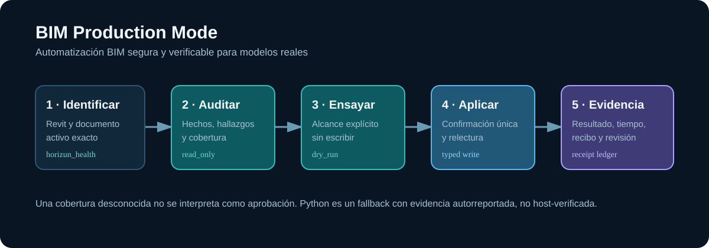
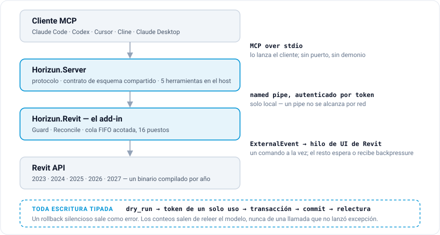

# Horizun Revit MCP — un servidor MCP para Autodesk Revit

**[English](README.md)** · **Español**

**[Descargar el instalador de Windows](https://github.com/HorizunGroup/horizun-revit-mcp/releases/latest)** — instalador público de Windows con el servidor y los add-ins de Revit incluidos. **No hace falta Git, Visual Studio ni el SDK de .NET.** Requiere Windows x64 y Revit 2023–2027; cierra Revit antes de instalar. [Preguntas frecuentes de descarga e instalación](docs/INSTALL.md). Las versiones públicas van sin firmar; mira las [instrucciones de verificación y primer arranque](#instalar).

[](https://github.com/HorizunGroup/horizun-revit-mcp/actions/workflows/ci.yml) [](https://github.com/HorizunGroup/horizun-revit-mcp/actions/workflows/codeql.yml) [](https://github.com/HorizunGroup/horizun-revit-mcp/releases/latest) [](#instalar) [](https://registry.modelcontextprotocol.io/) [](LICENSE)

**Hecho en Colombia 🇨🇴 — ingeniería desde Latinoamérica, para equipos AEC de cualquier parte.**

Apunta Claude —o Codex, Cursor, Cline, Windsurf, cualquier cliente MCP— a un
Autodesk Revit abierto y deja que lea y escriba el modelo, bajo un solo contrato:

> **Ningún comando reporta trabajo que no verificó.**

Toda escritura tipada se relee del modelo después del commit, así que un
rollback silencioso sale como error en vez de como un éxito falso, y los conteos
salen de releer el modelo y no de llamadas que no lanzaron excepción. **Libre y
de código abierto, Apache-2.0.** Parte del ecosistema
[Horizun Hub](https://horizunhub.com).

**Qué es esto.** El puente: transporte, guardas de seguridad y una superficie
genérica de herramientas sobre la API de Revit, para Revit 2023 a 2027. Neutral
por diseño: no lleva dentro los estándares, catálogos ni reglas de nomenclatura
de ninguna organización; donde un comando necesita uno, entra como dato en la
llamada.

**Qué no es.** Una metodología. Los estándares, los criterios de auditoría y los
reportes que convierten estos comandos en flujos de entrega viven en
[Horizun Hub](https://horizunhub.com). Este repositorio es el enchufe; el Hub es
lo que se conecta a él.

Para una explicación de producto pensada para equipos BIM y para quien decide,
mira **[Horizun Revit MCP — Product overview](docs/PRODUCT-OVERVIEW.md)** (en
inglés).

## Modo Producción BIM

Horizun Revit MCP es además una superficie práctica de producción BIM: una forma
auditable de inspeccionar, preparar y cambiar un modelo real de Revit. Empieza
por un flujo de trabajo, no por el nombre de una herramienta. Cada flujo declara
su alcance, si escribe, el nivel de permiso que necesita y la evidencia que
devuelve.

- **[Empezar en cinco pasos](docs/QUICK-START-BIM.md)** — conectar un modelo y
  correr una primera auditoría de solo lectura.
- **[¿Qué puede hacer Horizun hoy?](docs/WHAT-CAN-HORIZUN-DO.md)** —
  capacidades, permisos y evidencia por tarea BIM.
- **[Flujos de producción](docs/WORKFLOWS.md)** — prompts listos para copiar,
  para modelo, planos, familias, cuartos, cantidades y trabajo de DWG a BIM.
- **[BIM Standards Pack](standards/README.md)** — perfiles base opcionales,
  genéricos y editables. Son datos, no reglas incrustadas en el add-in.
- **[Código abierto y Horizun Hub](docs/HORIZUN-HUB.md)** — qué es capacidad
  pública y genérica del puente, y qué pertenece a flujos de entrega gobernados.

El puente sigue siendo neutral: un pack que se suministra es un punto de
partida, no la afirmación de que todo proyecto deba usar la misma nomenclatura,
los mismos límites o los mismos parámetros. Las reglas de proyecto y de empresa
hay que revisarlas, versionarlas y suministrarlas explícitamente.



## Qué le puedes pedir

Lenguaje corriente a la izquierda; lo que el puente hace de verdad a la derecha.
Nada de esto está guionizado de antemano: las herramientas las elige el cliente.

| Le pides | Qué pasa |
| --- | --- |
| *«¿Con qué Revit estás hablando y qué documento está abierto?»* | `horizun_health` responde con el año y el build de Revit, la versión y el commit del add-in, y el documento activo — o un «ninguno está activo» explícito, nunca un título en blanco. |
| *«¿Cuántos muros hay en el Nivel 2, con tipo y área, incluyendo los vínculos?»* | `horizun_query_model` recorre el anfitrión y cada vínculo cargado, proyecta los parámetros que nombraste, y reporta la cobertura más de qué vínculo salió cada fila. Los vínculos descargados se listan, no se omiten en silencio. |
| *«Pon el keynote de estos 40 tipos en D021-A2-A14.»* | `horizun_set_keynote` primero reporta el radio de impacto —a cuántas instancias afecta ese cambio de tipo—, luego escribe, luego relee todas. |
| *«Agrega el Nivel 3 a 7,20 m, un plano de planta para él, y ponlo en una hoja nueva.»* | `horizun_create_elements` y `horizun_manage_views` se componen en un solo grupo de transacción ordenado; un fallo en cualquier punto revierte el grafo entero. |
| *«Divide estos muros multicapa en un muro por capa de material.»* | `horizun_split_multilayer_walls` rehospeda puertas y ventanas en la capa estructural — y **rechaza los muros curvos en vez de enderezarlos**. |
| *«Exporta las plantas a PDF y el modelo a IFC.»* | `horizun_export` hace primero un ensayo y después atribuye únicamente los archivos cambiados, no vacíos, que corresponden a lo que pediste. |
| *«Créame un RFA paramétrico a partir de este perfil.»* | `horizun_create_family` compila una familia cargable desde un RFT —parámetros, fórmulas, tipos, planos de referencia, cotas, sólidos y vacíos— y luego verifica tanto el archivo como la familia cargada en el proyecto. |
| *«Haz X — y no hay herramienta para X.»* | La llamada tipada fallida devuelve `fallback.allowed: true` solo cuando no se escribió nada. El cliente escribe entonces el Python de Revit mínimo para `horizun_execute_python`, cuyos resultados se etiquetan **autorreportados, nunca verificados por el host**. |

El noventa por ciento del diseño está en el «no». Una losa cuyas familias
hospedadas no se pueden reponer revierte sola; un conteo de interferencias en
cero es un cero del que te puedes fiar; una petición ambigua se rechaza con un
motivo en vez de resolverse adivinando.

```jsonc
// horizun_health, abreviado
{
  "status": "healthy",
  "horizun_version": "1.0.0",
  "horizun_commit": "ced1aa1",
  "built_from_clean_tree": true,
  "revit_version": "2026",
  "revit_build": "20250406_1515(x64)",
  "no_active_document": false,
  "active_document": { "title": "TORRE-A-EST.rvt", "is_workshared": true },
  "open_document_count": 3
}
```

## Instalar

Windows, al menos un Revit 2023–2027, y **Revit cerrado**. Todo lo demás lo
comprueba el instalador por ti, y no cambia nada cuando se niega.

### 1 · Consigue el instalador y verifícalo

Descarga `horizun-mcp-<versión>-setup.exe` y `SHA256SUMS.txt` de la
[última versión](https://github.com/HorizunGroup/horizun-revit-mcp/releases/latest),
y comprueba el hash antes de ejecutar nada:

```powershell
Get-FileHash .\horizun-mcp-<versión>-setup.exe -Algorithm SHA256
Select-String -Path .\SHA256SUMS.txt -Pattern 'setup.exe'
```

Toda versión instalable lleva un `manifest.json` de su contenido,
`package-hashes.json` y un [SBOM](https://cyclonedx.org/). Las versiones
estables llevan además un informe de verificación en vivo por cada año de Revit
soportado.

> **Lee esto antes de ejecutarlo.** Las versiones de Windows de Horizun van
> **sin firmar a propósito**. El SHA-256, el manifiesto del contenido, el SBOM y
> la atestación de procedencia verifican los bytes publicados; no autentican a
> un editor de Windows. Por eso el arranque exige el reconocimiento explícito
> `-AllowUnsigned` que se ve abajo, y Windows o Revit pueden mostrar un aviso de
> editor desconocido. Los artefactos públicos inválidos o autofirmados se
> rechazan. Mira la [política de versiones sin firmar](CODE-SIGNING-POLICY.md).

Si prefieres que el script haga esas mismas comprobaciones, una sola línea
verifica el SHA-256 completo contra esa misma versión de GitHub, instala en
silencio y termina el registro de clientes:

```powershell
$s = irm https://raw.githubusercontent.com/HorizunGroup/horizun-revit-mcp/main/install-release.ps1; & ([scriptblock]::Create($s)) -AllowUnsigned
```

Descárgalo primero y pasa `-Version <tag>` para fijar una versión, o
`-Interactive` para el asistente. Silencioso, última versión y finalización
automática de clientes son los valores por defecto.

### 2 · Deja que configure tu cliente MCP

El mismo instalador sirve a todos los clientes soportados, y todos ejecutan el
mismo `horizun-mcp.exe` instalado:

| Cliente | Qué hace el instalador | Último paso |
|---|---|---|
| **Codex** | Registra `horizun-revit` junto a los demás servidores MCP. | Reiniciar Codex. |
| **Claude Code** | Registra `horizun-revit` con alcance de usuario. | Reiniciar Claude Code. |
| **Claude Desktop** | Escribe su entrada `mcpServers`, y además deja preparado el `.mcpb`. | Abrir Claude Desktop. |
| **ChatGPT Work** | Instala su ayudante de Secure MCP Tunnel. | Crear/arrancar el túnel y añadirlo en ChatGPT Work. |

**Cierra Revit y Claude Desktop antes de ejecutar el instalador.** Ese es todo
el procedimiento para Claude Desktop: ciérralos, ejecuta el instalador, abre
Claude Desktop. Nada que instalar dentro de la app y ningún archivo que buscar.

El que enreda a la gente es Claude Desktop. Reescribe su propia configuración de
memoria al cerrarse, así que un cambio hecho por debajo de la app abierta se
pierde en silencio y el único síntoma es que las herramientas nunca aparecen.
Por eso el instalador **se niega** a escribir mientras está abierta, en vez de
escribir con esperanza — y si estaba abierta, no hay nada roto ni hay que
reinstalar: ciérrala y ejecuta **Horizun → Conectar Horizun con Claude Desktop**
desde el menú Inicio.

El instalador espera a que Claude Code o Codex se cierren antes de editar su
configuración, hace copias con marca de tiempo, conserva todas las demás
entradas MCP y verifica lo que escribió. El estado durable vive en
`%LOCALAPPDATA%\Horizun\install-status.json`. El procedimiento exacto por
cliente está en **[docs/CLIENTS.md](docs/CLIENTS.md)** (en inglés).

<details>
<summary>Registro manual, por si alguna vez hace falta</summary>

Usa la **ruta exacta que imprimió el instalador**. Ya viene expandida para tu
máquina, y eso importa: `%LOCALAPPDATA%` la expande `cmd.exe` y **no** la
expande PowerShell, así que una configuración escrita con la variable apunta a
ninguna parte sin decirlo.

```powershell
# con Claude Code cerrado — el alcance de usuario lo deja disponible en todos los proyectos
claude mcp add --scope user horizun-revit -- "C:\Users\<TÚ>\AppData\Local\Programs\Horizun\MCP\server\horizun-mcp.exe"

# con Codex cerrado
codex mcp add horizun-revit -- "C:\Users\<TÚ>\AppData\Local\Programs\Horizun\MCP\server\horizun-mcp.exe"
```

```toml
# timeouts de Codex — %USERPROFILE%\.codex\config.toml
[mcp_servers.horizun-revit]
command = 'C:\Users\<TÚ>\AppData\Local\Programs\Horizun\MCP\server\horizun-mcp.exe'
args = []
startup_timeout_sec = 120
tool_timeout_sec = 600
```

```json
// Cursor, Cline, Windsurf y otros clientes MCP
{
  "mcpServers": {
    "horizun-revit": {
      "command": "C:\\Users\\<TÚ>\\AppData\\Local\\Programs\\Horizun\\MCP\\server\\horizun-mcp.exe"
    }
  }
}
```

**Claude Desktop no necesita Claude Code.** Con la app cerrada, un solo comando
lo conecta y termina; `-Extension` entrega en su lugar el `.mcpb` real y
pregunta dónde dejarlo:

```powershell
pwsh -File scripts/install-claude-desktop-extension.ps1              # conectarlo, de principio a fin
pwsh -File scripts/install-claude-desktop-extension.ps1 -Extension   # entregar el .mcpb
pwsh -File scripts/install-claude-desktop-extension.ps1 -Diagnose    # qué hay puesto de verdad
pwsh -File scripts/diagnose-integrations.ps1                         # Codex, Claude Code, Claude Desktop y ChatGPT Work
```

**ChatGPT Work no necesita Codex ni Claude Code.** Llega al mismo servidor
instalado a través del Secure MCP Tunnel de OpenAI. Ejecuta
`scripts/chatgpt-tunnel.ps1 -Status` o usa **Configurar ChatGPT Work** en el
menú Inicio. Esto se verificó en la interfaz de escritorio de Work con una
cuenta gratuita el 2026-09-04; los controles de cuenta y de espacio de trabajo
pueden variar.

Las cadenas literales de TOML (comillas simples) aceptan las rutas de Windows
tal cual; en JSON hay que doblar cada barra invertida. **Sube el tool timeout**
de tu cliente si lo tiene: un escaneo de modelo o una apertura por lotes ocupa
el hilo de UI de Revit durante minutos, y un límite de 60 segundos abandona
trabajo que sigue corriendo — el puente parece roto cuando solo está ocupado.

</details>

### 3 · Arranca Revit y comprueba

Dos cosas que esperar en el primer arranque, y ninguna es un fallo:

- Revit puede mostrar un diálogo de **Security** cuando el editor no es ya de
  confianza — tras verificar el build, elige **Always Load**. Puede abrirse **en
  un monitor que no estás mirando**: un Revit que parece atascado arrancando con
  la CPU quieta suele ser este diálogo escondido.
- Con un documento abierto aparece la pestaña **Horizun Hub** en la cinta. Su
  botón *Estado del puente* responde «¿esto funciona, y qué versión es?» sin
  salir de Revit.

Desde tu cliente MCP, `horizun_health` responde lo mismo incluyendo el commit.
Un *contract hash mismatch* significa que una mitad se quedó en un build
anterior: cierra Revit e instala otra vez.

### Compilar desde el código, si lo prefieres

No se descarga ni se ejecuta nada precompilado: todo se compila en tu máquina
contra el Revit que ya tienes instalado. Necesitas el
[SDK de .NET 10.0.400](https://dotnet.microsoft.com/download), fijado por
`global.json` para que los bytes publicados no dependan del último parche
instalado. Los add-ins resultantes siguen apuntando al runtime que hospeda cada
año de Revit: .NET Framework 4.8 para 2023–2024, .NET 8 para 2025–2026 y .NET 10
para 2027.

```powershell
git clone https://github.com/HorizunGroup/horizun-revit-mcp
cd horizun-revit-mcp
powershell -ExecutionPolicy Bypass -File .\install.ps1
```

Encuentra cada Revit por su propio `RevitAPI.dll`, compila el add-in para cada
uno de esos años y el servidor MCP, instala ambos, y relee cada binario
instalado para probar que llegó — commit estampado más SHA-256 contra lo
preparado. Un fallo de compilación no cambia nada; un fallo posterior revierte
con su libro de deshacer y te dice el estado exacto en el que estás. Para
actualizar: `git pull`, cierra Revit, ejecútalo otra vez.

Para una instalación normal a través de un agente, usa el instalador publicado.
Compilar desde el código es para desarrollo. Pega esto en tu agente:

```
Install the latest stable Windows release of Horizun Revit MCP from
https://github.com/HorizunGroup/horizun-revit-mcp/releases/latest. Read
https://github.com/HorizunGroup/horizun-revit-mcp/blob/main/docs/INSTALL.md first.
Use the published installer, verify its hash and explain its unsigned publisher
status. Do not clone or compile the source or install a development SDK.
Preserve other MCP entries and report pending client connection/restart steps.
```

Ambos recogen [AGENTS.md](AGENTS.md) automáticamente en cuanto están dentro del
repositorio. Ese archivo lleva los requisitos, los modos de fallo y las dos
sorpresas que conviene conocer antes del primer arranque de Revit, y está en
inglés y español.

## Arquitectura



- **`Horizun.Revit`** — el add-in. `App` (IExternalApplication) levanta un
  servidor de named pipe y publica un archivo de descubrimiento; `Dispatcher`
  cruza cada petición al hilo de UI de Revit vía `ExternalEvent`; `Guard` y
  `Reconcile` son el contrato de commit que «no puede mentir»; los comandos
  viven bajo `Commands/`.
- **`Horizun.Server`** — el servidor MCP. El formato de cable está escrito a
  mano desde la especificación abierta de MCP, sin SDK de terceros: descubre el
  pipe, habla MCP sobre stdio y reenvía al plugin. Los esquemas y los efectos de
  comportamiento viven en un solo contrato compartido, así que `tools/list`
  responde con Revit cerrado sin desviarse del add-in. Negocia MCP hasta
  2025-11-25; expone Tools, Resources, Prompts, Completions, Logging opcional y
  Tasks durables; y devuelve tanto texto compatible como `structuredContent`.
  Cinco herramientas son **residentes en el host**: responden dentro del
  servidor y nunca tocan Revit.
- **Un comando a la vez.** Las llamadas concurrentes esperan en una cola FIFO
  acotada de 16 puestos; una cola llena aplica backpressure explícita en vez de
  descartar trabajo. Cada respuesta lleva lo que Revit levantó mientras el
  comando corría —avisos, errores y diálogos modales— tanto si salió bien como
  si falló.

## Capacidades

Agrupadas por lo que realmente estarías haciendo. La referencia completa —cada
herramienta, y qué rechaza cada una— está en
**[docs/TOOLS.md](docs/TOOLS.md)** (en inglés).

| Grupo | Qué cubre |
| --- | --- |
| **Sesión** | Salud y selección de destino entre dos versiones de Revit abiertas, abrir/guardar/liberar documento, inspección de sesión, captura de vista como imagen. |
| **Consulta** | Consultas componibles e inventario paginado sobre anfitrión y vínculos cargados, censo del modelo, cantidades, interferencias, lectura de tablas de planificación nativas. |
| **Escritura** | Escritura de parámetros, keynotes, borrado con la cascada contada, transformaciones, creación atómica de niveles, ejes, muros, losas, cubiertas, cuartos, redes MEP y estructura. |
| **Vistas y planos** | Plantas conscientes de dependencias, secciones, alzados, vistas 3D y de dibujo, plantillas, hojas, viewports, tablas y anotación. |
| **Detalle 2D** | Descubrimiento semántico de recursos por vista (estilos de línea, tipos de región con `IsMasking` real, símbolos colocables — siempre por id, nunca por nombre), y dibujo atómico, ensayado y revertido por completo: líneas, arcos, polilíneas, regiones rellenas/de máscara con bucles validados de forma pura, componentes y símbolos de detalle, edición de estilos de línea. |
| **Cotas** | Descubrimiento semántico de referencias (caras, centerlines, ejes, niveles, aristas — con huellas y ambigüedad estructurada en vez de adivinanzas), acotado lineal/angular/radial/diámetro/longitud de arco/elevación ensayado por creación, con rollback total y rechazo por deriva `stale_plan`, lecturas completas de cotas y ediciones verificadas. El flujo completo con ejemplos está en **[docs/DIMENSIONS.md](docs/DIMENSIONS.md)**. |
| **Planimetría** | Documentación de principio a fin directamente en Revit, sin un lazo de control por PDF: consultar y auditar hojas/vistas/colocaciones/anotaciones; corregir hallazgos citados; empaquetar vistas y tablas ordenadas automáticamente alrededor de obstáculos fijos; planear etiquetas conscientes de colisión y cadenas de cotas semánticas; aplicarlas por el escritor de anotación ensayado; crear revisiones, asignaciones a hoja y nubes verificadas; y después capturar y revisar visualmente cada hoja real por el prompt MCP `planimetry-review`. El trabajo ilegible, truncado, ambiguo o no capturado queda como desconocido o rechazado, nunca como limpio. Mira **[docs/PLANIMETRY-AUDIT.md](docs/PLANIMETRY-AUDIT.md)** y **[docs/PLANIMETRY-PRODUCTION.md](docs/PLANIMETRY-PRODUCTION.md)**. |
| **Familias** | Compilación RFT → RFA con parámetros, fórmulas, tipos, cotas, instancias anidadas, formas sólidas y de vacío y conectores MEP; duplicación de tipos de sistema con estructuras compuestas completas. |
| **Interoperabilidad** | PDF, DWG, IFC configurable, Navisworks NWC, FBX multivista, imágenes, tablas, `.xlsx` escrito sobre el paquete OPC, e ingesta directa por push a Power BI. |
| **Cantidades → presupuesto** | Un cómputo de las cantidades que TÚ nombras (parámetro, volumen/área de geometría, longitud, conteo) por elemento y por código de presupuesto, atravesando los vínculos cargados con procedencia, donde un cero es una medición y ausente / vacío / ilegible / inválido son cuatro respuestas distintas; y luego una comparación contra una línea base leída de Excel — añadido / eliminado / modificado / sin cambio / no comparable por código, con las diferencias de cantidad, clasificación y precio separadas, sin convertir ninguna unidad ni inventar ningún precio — escrita a Excel y Power BI reportando cada destino por separado. Mira **[docs/QUANTITIES-AND-BUDGET.md](docs/QUANTITIES-AND-BUDGET.md)**. |
| **DWG → BIM** | Convertir un dibujo vinculado en modelo a través de un conjunto de requisitos VERSIONADO que es tuyo en vez de venir compilado: vincular y recargar de forma tipada, leer la geometría con un bloque de cobertura explícito que nombra lo que no se puede leer, planear, ensayar, aplicar, y estampar cada elemento creado con la entidad CAD de la que salió. Muros rectos y curvos, losas con huecos, cuartos colocados por un punto genuinamente dentro de ellos, puertas y ventanas hospedadas en el muro que el dibujo implica, columnas, ejes, y muros y losas portantes verificados releyendo el propio parámetro de Revit. Y después AUDITAR el resultado contra el dibujo, y planear una segunda revisión contra la primera nombrando lo que cambió desde un vocabulario cerrado: sin cambio, añadido, eliminado, movido, reformado, retipificado, recapado, redimensionado, rehospedado, divergido manualmente, ambiguo, conflicto. Nunca se borra nada automáticamente y nunca se toma un juicio en silencio. El flujo, el esquema del conjunto de requisitos y lo que un dibujo no te puede decir están en **[docs/DWG-TO-BIM.md](docs/DWG-TO-BIM.md)**; **[docs/ADR-001-direct-dwg-reader.md](docs/ADR-001-direct-dwg-reader.md)** registra lo que deliberadamente no lee, y por qué. |
| **Cirugía de modelo** | División por capas, división de bucles de losa, desagrupar/reagrupar por parámetro, copia de cotas de losa, embebido y explanación de toposolid, rectangularización de muros. |
| **Orquestación** | Hasta 100 escrituras tipadas en un solo plan ordenado con referencias `${key.path}`, más trabajos durables en segundo plano consultados sin tocar Revit. |

<details>
<summary>Conexión directa con Power BI</summary>

`horizun_power_bi_push` usa el endpoint REST de modelo semántico push de
Microsoft; no automatiza Power BI Desktop. Las credenciales se configuran en el
entorno del servidor MCP, nunca en una llamada de herramienta:

```powershell
# Opción A: token de acceso OAuth de vida corta
$env:HORIZUN_POWER_BI_ACCESS_TOKEN = '<token con Dataset.ReadWrite.All>'

# Opción B: service principal de Entra; Horizun obtiene el token de acceso
$env:HORIZUN_POWER_BI_TENANT_ID = '<tenant-guid>'
$env:HORIZUN_POWER_BI_CLIENT_ID = '<application-guid>'
$env:HORIZUN_POWER_BI_CLIENT_SECRET = '<secreto>'
```

El destino está fijado a `api.powerbi.com`; los ids de dataset y de workspace
tienen que ser GUID; los valores son solo JSON primitivo; la unión se limita a
75 columnas, las cadenas a 4.000 caracteres y cada llamada a 10.000 filas,
siguiendo las
[limitaciones de modelos semánticos push](https://learn.microsoft.com/power-bi/developer/embedded/push-datasets-limitations)
de Microsoft. Ejecuta con el `dry_run: true` por defecto, y luego aplica con un
`idempotency_key` nuevo. Un reintento idéntico repite la respuesta guardada; una
pérdida de conexión después de subir se reporta como `in_doubt` y nunca se
reenvía automáticamente.

</details>

## Estado y evidencia

Funcionando y en uso productivo. La promoción a estable la gobierna evidencia
publicada y acotada a la versión, no una afirmación local de éxito.

- **Las suites sin Revit se exigen en CI**, y solo esas. Un runner hospedado no
  tiene `RevitAPI.dll`, así que compilar allí el add-in sería mentira; la mitad
  atada a Revit se verifica en vivo con `scripts/verify-live.ps1` y se publica
  por versión. Un trabajo omitido que dice por qué vale más que un visto bueno
  que cubrió menos de lo que aparentaba.
- **Compilado para cinco años de Revit** — de 2023 a 2027, cada uno contra su
  propia API. El servidor y el add-in comparten el hash de un contrato y viajan
  juntos; no hay despliegue parcial.
- **La evidencia viva está acotada a la versión.** Promover a estable exige un
  informe publicado por cada año soportado. Si falta un artefacto, no se
  sustituye por experiencia local ni por una DLL compilada. Mira la
  [política de versiones](docs/RELEASE-POLICY.md).
- **Límites conocidos, declarados**: `excel_write_rows` añade debajo de una
  Tabla de Excel sin expandir el rango de la tabla (se reporta en cada llamada);
  un catálogo que no es ni UTF-8 ni Latin-1 se decodifica como Latin-1 y lo
  dice; cancelar una petición la evita solo mientras sigue en cola — una vez
  Revit empieza el comando, cancelar deja de hacerte esperar pero no puede
  interrumpir la API de Revit en su hilo de UI. La creación general de familias
  in-place no existe en la API pública de Revit, así que Horizun crea familias
  RFA cargables y tipos de sistema residentes en el proyecto en vez de manejar
  el editor de familias modal por automatización de UI.

La comparación pública se hace por tarea y no por número de herramientas: una
capacidad puntúa solo si su esquema es tipado, si la entrada inválida se rechaza
antes de mutar, y si el resultado afirmado se mide después de la operación. Los
casos, las reglas de puntuación y los resultados actuales están en
[docs/BENCHMARK.md](docs/BENCHMARK.md).

```bash
dotnet build src/Horizun.Revit -c Release -p:RevitYear=2026   # un año a la vez
dotnet build src/Horizun.Server -c Release                    # el servidor MCP (sin Revit)
dotnet test tests/Horizun.Core.Tests
dotnet test tests/Horizun.Server.Tests
pwsh scripts/verify-live.ps1 -Year 2026 -OldFile <un modelo guardado en otro Revit>
```

## Seguridad

`horizun_execute_python` ejecuta Python arbitrario dentro de Revit con los
derechos del usuario que inició sesión, y viene **deshabilitado por defecto**.
Una instalación nueva se lee como `permission_profile: "safe_write"`: las
ediciones tipadas verificadas dentro del modelo activo están disponibles,
mientras que el código arbitrario, los cambios de sesión de documento y las
escrituras externas exigen una decisión explícita del dueño.

Una elección **explícita** en `%USERPROFILE%\.horizun\settings.json` se respeta
siempre — `read_only`, `safe_write`, `full_write` o
`enable_execute_python: false` mantienen el código arbitrario apagado,
`allowed_tools` y `denied_tools` estrechan cualquier perfil, y un archivo de
ajustes que existe pero no se puede interpretar cae **cerrado** (`read_only`,
Python apagado) para que una restricción corrupta nunca se lea como
consentimiento. Un cliente puede llamar `horizun_request_python_access` para
poner la pregunta de forma visible en Revit, pero no puede responderla. El dueño
de la máquina puede usar el botón **Python ON/OFF** para conceder acceso
persistente hasta que ese mismo usuario lo revoque; pulsarlo otra vez revoca el
permiso de inmediato. `scripts/enable-execute-python.ps1` sigue siendo la vía
administrativa explícita y se revierte con `-Disable`. El servidor emite
`notifications/tools/list_changed` cuando cambia el permiso efectivo, así que
los clientes compatibles se actualizan solos; los que ignoran la notificación
necesitan un reinicio.

**No hay ningún listener de red entrante**: los named pipes no se alcanzan por
red, y el servidor habla stdio con quien lo haya lanzado. El opcional
`horizun_power_bi_push` hace llamadas HTTPS salientes acotadas únicamente a
endpoints fijos de Microsoft Entra y `api.powerbi.com`, y no acepta ninguna URL
ni credencial en los argumentos de la herramienta. No hay telemetría ni
recolección de datos operada por quien mantiene el proyecto.

El modelo de amenazas completo —qué se defiende, y qué deliberadamente no— está
en [docs/security-model.md](docs/security-model.md), y está escrito para que se
discuta. El estado local y las operaciones de red pedidas por el usuario se
describen en la [política de privacidad](docs/PRIVACY.md). Para reportar una
vulnerabilidad, mira [SECURITY.md](SECURITY.md). La línea exacta entre evidencia
de candidato desde código y certificación externa se mantiene en
[production readiness](docs/production-readiness.md).

## Horizun Hub

[Horizun Hub](https://horizunhub.com) es el ecosistema de producto al que
pertenece este puente: PowerBIM Exporter para Revit y Civil 3D, PowerBIM Online,
BuildMotion, CopyToExcel y Family Browser; formación en PowerBIM + IA;
plantillas de cuantificación 4D/5D; tableros de Power BI y plantillas `.pbit`;
agentes y flujos MCP para estandarizar familias y auditar modelos; y extracción
de APS a Power BI.

El MCP sigue siendo neutral: los estándares de empresa, los catálogos y las
reglas de auditoría los suministran esos flujos o quien llama, nunca vienen
compilados dentro del puente. [docs/HORIZUN-HUB.md](docs/HORIZUN-HUB.md) traza
la línea completa entre la pasarela de código abierto y el Hub.

## Contribuir

Los issues y los pull requests son bienvenidos — reportes de fallos, hallazgos
de compatibilidad por año de Revit y propuestas de capacidad tienen cada uno su
formulario. Empieza por [CONTRIBUTING.md](CONTRIBUTING.md) y el
[código de conducta](CODE_OF_CONDUCT.md); [AGENTS.md](AGENTS.md) es la versión
legible por máquina de esas mismas reglas, y [llms.txt](llms.txt) es el resumen
de descubrimiento para indexadores y sistemas de IA.

## Licencia

**Apache License 2.0** — mira [LICENSE](LICENSE) y [NOTICE](NOTICE). Los
componentes de terceros siguen bajo sus propias licencias, listados con sus
versiones en [THIRD-PARTY-NOTICES.md](THIRD-PARTY-NOTICES.md).

La API de Autodesk Revit se referencia en tiempo de compilación y nunca se
redistribuye. Revit, Autodesk y Autodesk Docs son marcas de Autodesk, Inc. Este
proyecto no está afiliado a Autodesk, Inc., ni cuenta con su respaldo o
patrocinio.
