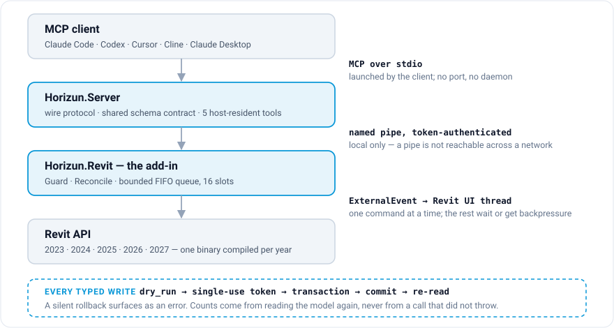

# Horizun Revit MCP — an MCP server for Autodesk Revit

[](https://github.com/HorizunGroup/horizun-revit-mcp/actions/workflows/ci.yml) [](https://github.com/HorizunGroup/horizun-revit-mcp/actions/workflows/codeql.yml) [](https://github.com/HorizunGroup/horizun-revit-mcp/releases/latest) [](#install) [](https://registry.modelcontextprotocol.io/) [](LICENSE)

Point Claude — or Codex, Cursor, Cline, Windsurf, any MCP client — at a running
Autodesk Revit and let it read and write the model, under one contract:

> **A command never reports work it did not verify.**

Every typed write is re-read from the model after the commit, so a silent
rollback becomes an error instead of a false success, and counts come from
reading the model again rather than from calls that did not throw. **Free and
open source, Apache-2.0.** Part of the [Horizun Hub](https://horizunhub.com)
ecosystem.

**What this is.** The bridge: transport, safety guards and a generic tool
surface over the Revit API, for Revit 2023 through 2027. Organisation-neutral by
design — no company's standards, catalogues or naming rules are compiled in;
where a command needs one, it is an input supplied at call time.

**What this is not.** A methodology. The standards, audit criteria and reporting
that turn these commands into delivery workflows live in
[Horizun Hub](https://horizunhub.com). This repository is the socket; the Hub is
what plugs into it.

## What you can ask it

Ordinary language on the left; what the bridge actually does on the right. None
of it is scripted in advance — the client picks the tools.

| You ask | What happens |
| --- | --- |
| *"Which Revit are you talking to, and which document is open?"* | `horizun_health` answers with the Revit year and build, the add-in version and commit, and the active document — or an explicit "none is active", never a blank title. |
| *"How many walls on Level 2, with type and area, including the linked models?"* | `horizun_query_model` walks the host and every loaded link, projects the parameters you named, and reports coverage plus which link each row came from. Unloaded links are listed, not silently skipped. |
| *"Set the keynote of these 40 types to D021-A2-A14."* | `horizun_set_keynote` first reports the blast radius — how many instances that type change touches — then writes, then re-reads every one. |
| *"Add Level 3 at 7.20 m, a floor plan for it, and put it on a new sheet."* | `horizun_create_elements` and `horizun_manage_views` compose in one ordered transaction group; a failure anywhere rolls the whole graph back. |
| *"Split these multilayer walls into one wall per material layer."* | `horizun_split_multilayer_walls` re-hosts doors and windows on the structural layer — and **refuses curved walls instead of straightening them**. |
| *"Export the floor plans to PDF and the model to IFC."* | `horizun_export` runs a dry run first and afterwards attributes only the changed, non-empty files that match what you asked for. |
| *"Build me a parametric RFA from this profile."* | `horizun_create_family` compiles a loadable family from an RFT — parameters, formulas, types, reference planes, dimensions, solids and voids — then verifies both the file and the loaded project family. |
| *"Do X — and there is no tool for X."* | The failed typed call returns `fallback.allowed: true` only when nothing was written. The client then writes minimal Revit Python for `horizun_execute_python`, whose results are labelled **self-reported, never host-verified**. |

Ninety per cent of the design is in the "no". A slab whose hosted families
cannot be put back rolls back alone; a clash count of zero is a zero you can
trust; an ambiguous request is refused with a reason instead of resolved by
guessing.

```jsonc
// horizun_health, abbreviated
{
  "status": "healthy",
  "horizun_version": "1.0.0",
  "horizun_commit": "ced1aa1",
  "built_from_clean_tree": true,
  "revit_version": "2026",
  "revit_build": "20250406_1515(x64)",
  "no_active_document": false,
  "active_document": { "title": "TORRE-A-EST.rvt", "is_workshared": true },
  "open_document_count": 3
}
```

## Install

Windows, at least one Revit 2023–2027, and **Revit closed**. Everything else the
installer checks for you, and it changes nothing when it refuses.

### 1 · Get the installer and verify it

Download `horizun-mcp-<version>-setup.exe` and `SHA256SUMS.txt` from the
[latest release](https://github.com/HorizunGroup/horizun-revit-mcp/releases/latest),
then check the hash before running anything:

```powershell
Get-FileHash .\horizun-mcp-<version>-setup.exe -Algorithm SHA256
Select-String -Path .\SHA256SUMS.txt -Pattern 'setup.exe'
```

Every installable release carries a payload `manifest.json`,
`package-hashes.json` and an [SBOM](https://cyclonedx.org/). Stable releases also
carry one live verification report per supported Revit year.

> **Read this before you run it.** Horizun Windows releases are intentionally
> **unsigned**. SHA-256, the payload manifest, SBOM and build-provenance
> attestation verify the released bytes; they do not authenticate a Windows
> publisher. The bootstrap therefore requires the explicit `-AllowUnsigned`
> acknowledgement shown below, and Windows/Revit may show an unknown-publisher
> warning. Invalid or self-signed public artifacts are refused. See the
> [unsigned release policy](CODE-SIGNING-POLICY.md).

If you would rather have the script do the same checks, one paste verifies the
complete SHA-256 against that same GitHub release, installs quietly and finishes
client registration:

```powershell
$s = irm https://raw.githubusercontent.com/HorizunGroup/horizun-revit-mcp/main/install-release.ps1; & ([scriptblock]::Create($s)) -AllowUnsigned
```

Download it first and pass `-Version <tag>` to pin a release, or `-Interactive`
for the Setup wizard. Quiet, latest and automatic client completion are the
defaults.

### 2 · Let it configure your MCP client

The same Setup serves every supported client and every client runs the same
installed `horizun-mcp.exe`:

| Client | Setup result | Last step |
|---|---|---|
| **Codex** | Registers `horizun-revit` beside existing MCP servers. | Restart Codex. |
| **Claude Code** | Registers `horizun-revit` at user scope. | Restart Claude Code. |
| **Claude Desktop** | Builds and stages its `.mcpb` Desktop Extension. | Install the extension once inside Claude Desktop. |
| **ChatGPT Work** | Installs its Secure MCP Tunnel helper. | Create/start the tunnel and add it in ChatGPT Work. |

The installer waits for Claude Code or Codex to close before editing their
configuration, makes timestamped backups, preserves every other MCP entry, and
verifies what it wrote. Durable status lives in
`%LOCALAPPDATA%\Horizun\install-status.json`. See the exact per-client procedure
in **[docs/CLIENTS.md](docs/CLIENTS.md)**.

<details>
<summary>Manual registration, if you ever need it</summary>

Use the **exact path the installer printed**. It is already expanded for your
machine, which matters: `%LOCALAPPDATA%` is expanded by `cmd.exe` and **not** by
PowerShell, so a config written with the variable silently points nowhere.

```powershell
# after closing Claude Code — user scope makes it available across projects
claude mcp add --scope user horizun-revit -- "C:\Users\<YOU>\AppData\Local\Programs\Horizun\MCP\server\horizun-mcp.exe"

# after closing Codex
codex mcp add horizun-revit -- "C:\Users\<YOU>\AppData\Local\Programs\Horizun\MCP\server\horizun-mcp.exe"
```

```toml
# Codex timeouts — %USERPROFILE%\.codex\config.toml
[mcp_servers.horizun-revit]
command = 'C:\Users\<YOU>\AppData\Local\Programs\Horizun\MCP\server\horizun-mcp.exe'
args = []
startup_timeout_sec = 120
tool_timeout_sec = 600
```

```json
// Cursor, Cline, Windsurf and other MCP clients
{
  "mcpServers": {
    "horizun-revit": {
      "command": "C:\\Users\\<YOU>\\AppData\\Local\\Programs\\Horizun\\MCP\\server\\horizun-mcp.exe"
    }
  }
}
```

**Claude Desktop does not need Claude Code.** Prepare its real `.mcpb` Desktop
Extension and inspect every supported client from one screen:

```powershell
pwsh -File scripts/install-claude-desktop-extension.ps1   # a real .mcpb Desktop Extension
pwsh -File scripts/diagnose-integrations.ps1              # Codex, Claude Code, Claude Desktop and ChatGPT Work
```

**ChatGPT Work does not need Codex or Claude Code.** It reaches the same installed
server through OpenAI's Secure MCP Tunnel. Run
`scripts/chatgpt-tunnel.ps1 -Status` or use **Configurar ChatGPT Work** in the
Start menu. This was verified in the desktop Work interface with a free account
on 2026-09-04; account and workspace controls can vary.

TOML literal strings (single quotes) take Windows paths as they are; JSON needs
every backslash doubled. **Raise your client's tool timeout** if it has one: a
model scan or a batch open holds Revit's UI thread for minutes, and a 60-second
default gives up on work that is still running — the bridge then looks broken
while it is merely busy.

</details>

### 3 · Start Revit and check

Two things to expect on the first start, neither of them a fault:

- Revit can show a **Security** dialog when the publisher is not already trusted
  — after verifying the build, choose **Always Load**. It can open **on a monitor
  you are not looking at**: a Revit that seems stuck on startup with the CPU idle
  is often this dialog hiding.
- With a document open, a **Horizun Hub** tab appears in the ribbon. Its *Estado
  del puente* button answers "is this working, and which version?" without
  leaving Revit.

From your MCP client, `horizun_health` answers the same with the commit
included. A *contract hash mismatch* means one half is on an older build: close
Revit and install again.

### Build from source instead

Nothing prebuilt is downloaded or run: everything is compiled on your machine
against the Revit already installed. You need the
[.NET SDK 10.0.400](https://dotnet.microsoft.com/download), fixed by
`global.json` so release bytes do not depend on the latest installed patch. The
produced add-ins still target the runtime hosted by each Revit year: .NET
Framework 4.8 for 2023–2024, .NET 8 for 2025–2026 and .NET 10 for 2027.

```powershell
git clone https://github.com/HorizunGroup/horizun-revit-mcp
cd horizun-revit-mcp
powershell -ExecutionPolicy Bypass -File .\install.ps1
```

It finds every Revit by its own `RevitAPI.dll`, builds the add-in for each of
those years and the MCP server, installs both, and reads every installed binary
back to prove it landed — stamped commit plus SHA-256 against what was staged. A
build failure changes nothing; a failure after that rolls back through its undo
ledger and tells you the exact state you are in. To update: `git pull`, close
Revit, run it again.

Or hand the whole thing to an agent — paste this into **Claude Code** or
**Codex** in any folder:

```
Clone https://github.com/HorizunGroup/horizun-revit-mcp into this folder, read its
AGENTS.md, and follow the install procedure there. Install and verify the binaries,
then confirm the automatic completion status. Do not edit an active client's
configuration; let the installed helper finish registration after that client exits.
```

Both pick up [AGENTS.md](AGENTS.md) automatically once they are inside the
repository. It carries the prerequisites, the failure modes and the two
surprises worth knowing before the first Revit start.

## Architecture



- **`Horizun.Revit`** — the add-in. `App` (IExternalApplication) starts a
  named-pipe server and publishes a discovery file; `Dispatcher` crosses each
  request onto Revit's UI thread via `ExternalEvent`; `Guard` and `Reconcile` are
  the "cannot lie" commit contract; commands live under `Commands/`.
- **`Horizun.Server`** — the MCP server. The wire format is hand-rolled from the
  open MCP spec, with no third-party SDK: it discovers the pipe, speaks MCP over
  stdio and forwards to the plugin. Schemas and behavioural effects live in one
  shared contract, so `tools/list` answers with Revit closed without drifting
  from the add-in. It negotiates MCP through 2025-11-25; exposes standard Tools,
  Resources, Prompts, Completions, opt-in Logging and durable Tasks; and returns both
  backward-compatible text and `structuredContent`. Five tools are
  **host-resident** — they answer inside the server and never touch Revit.
- **One command at a time.** Concurrent calls wait in a bounded 16-slot FIFO
  queue; a full queue applies explicit backpressure instead of dropping work.
  Every reply carries what Revit raised while the command ran — warnings, errors
  and modal dialogs — on success and on failure.

## Capabilities

Grouped by what you would actually be doing. The complete reference — every
tool, and what each one refuses — is in **[docs/TOOLS.md](docs/TOOLS.md)**.

| Group | What it covers |
| --- | --- |
| **Session** | Health and target selection across two open Revit versions, document open/save/relinquish, session inspection, view capture as an image. |
| **Query** | Composable queries and paginated inventory across host and loaded links, model census, quantities, clash, native schedule read. |
| **Write** | Parameter writes, keynotes, deletion with the cascade counted, transforms, atomic creation of levels, grids, walls, floors, roofs, rooms, MEP runs and structural framing. |
| **Views & sheets** | Dependency-aware plans, sections, elevations, 3D and drafting views, templates, sheets, viewports, schedules and annotation. |
| **2D detail** | Semantic resource discovery per view (line styles, region types with real `IsMasking`, placeable symbols — always by id, never by name), and atomic, rehearsed, totally-rolled-back drafting: lines, arcs, polylines, filled/masking regions with pure-validated loops, detail components and symbols, line-style edits. |
| **Dimensions** | Semantic reference discovery (faces, centerlines, grids, levels, edges — with fingerprints and structured ambiguity instead of guesses), rehearsed-by-creation linear/angular/radial/diameter/arc-length/spot dimensioning with total rollback and `stale_plan` drift refusal, complete dimension reads, and verified edits. The full workflow with examples is in **[docs/DIMENSIONS.md](docs/DIMENSIONS.md)**. |
| **Planimetry** | End-to-end documentation directly in Revit, without a PDF control loop: query and audit sheets/views/placements/annotations; correct cited findings; pack ordered views and schedules automatically around fixed obstacles; plan collision-aware tags and semantic dimension chains; apply them through the rehearsed annotation writer; create verified revisions, sheet assignments and clouds; then capture and visually review every real sheet through the `planimetry-review` MCP prompt. Unreadable, truncated, ambiguous or uncaptured work is unknown/refused, never clean. See **[docs/PLANIMETRY-AUDIT.md](docs/PLANIMETRY-AUDIT.md)** and **[docs/PLANIMETRY-PRODUCTION.md](docs/PLANIMETRY-PRODUCTION.md)**. |
| **Families** | RFT → RFA compilation with parameters, formulas, types, dimensions, nested instances, solid/void forms and MEP connectors; system-type duplication with complete compound structures. |
| **Interoperability** | PDF, DWG, configurable IFC, Navisworks NWC, multi-view FBX, images, schedules, `.xlsx` written over the OPC package, and direct Power BI push ingestion. |
| **Quantities → budget** | A takeoff of the quantities YOU name (parameter, geometry volume/area, length, count) per element and per budget code, across loaded links with provenance, where a zero is a measurement and absent / empty / unreadable / invalid are four different answers; then a comparison against a budget baseline read from Excel - added / removed / modified / unchanged / not_comparable per code, with quantity, classification and price deltas kept apart, no unit converted and no price invented - written to Excel and Power BI with each destination reported on its own. See **[docs/QUANTITIES-AND-BUDGET.md](docs/QUANTITIES-AND-BUDGET.md)**. |
| **DWG → BIM** | Convert a linked drawing into a model through a VERSIONED requirement set that is yours rather than compiled in: link and reload typed, read the geometry with an explicit coverage block naming what cannot be read, plan, rehearse, apply, and stamp every created element with the CAD entity it came from. Walls straight and curved, floors with holes, rooms placed by a point genuinely inside them, doors and windows hosted in the wall the drawing implies, columns, grids, and load-bearing walls and slabs verified by re-reading Revit's own parameter. Then AUDIT the result against the drawing, and plan a second revision against the first with what changed named from a closed vocabulary - unchanged, added, removed, moved, reshaped, retyped, relayered, resized, rehosted, manually diverged, ambiguous, conflict. Nothing is ever deleted automatically and a judgement is never taken silently. The workflow, the requirement-set schema and what a drawing cannot tell you are in **[docs/DWG-TO-BIM.md](docs/DWG-TO-BIM.md)**; **[docs/ADR-001-direct-dwg-reader.md](docs/ADR-001-direct-dwg-reader.md)** records what it deliberately does not read, and why. |
| **Model surgery** | Layer splitting, floor-loop splitting, ungroup/regroup by parameter, slab elevation copying, toposolid embedding and grading, wall rectangularisation. |
| **Orchestration** | Up to 100 typed writes in one ordered plan with `${key.path}` references, plus durable background jobs polled without touching Revit. |

<details>
<summary>Direct Power BI connection</summary>

`horizun_power_bi_push` uses Microsoft's push semantic-model REST endpoint; it
does not automate Power BI Desktop. Credentials are configured in the
environment of the MCP server, never in a tool call:

```powershell
# Option A: short-lived OAuth access token
$env:HORIZUN_POWER_BI_ACCESS_TOKEN = '<token with Dataset.ReadWrite.All>'

# Option B: Entra service principal; Horizun obtains the access token
$env:HORIZUN_POWER_BI_TENANT_ID = '<tenant-guid>'
$env:HORIZUN_POWER_BI_CLIENT_ID = '<application-guid>'
$env:HORIZUN_POWER_BI_CLIENT_SECRET = '<secret>'
```

The destination is fixed to `api.powerbi.com`; dataset and workspace ids must be
GUIDs; values are primitive JSON only; the union is limited to 75 columns,
strings to 4,000 characters and each call to 10,000 rows, following Microsoft's
[push semantic-model limitations](https://learn.microsoft.com/power-bi/developer/embedded/push-datasets-limitations).
Run with the default `dry_run: true`, then apply with a new `idempotency_key`. An
identical retry replays the stored answer; a connection loss after upload is
reported `in_doubt` and is never sent again automatically.

</details>

## Status and evidence

Working and in production use. Stable promotion is governed by published,
release-scoped evidence rather than by a local success claim.

- **Revit-free suites are enforced in CI**, and only those. A hosted runner has
  no `RevitAPI.dll`, so building the add-in there would be a lie; the
  Revit-bound half is verified live with `scripts/verify-live.ps1` and published
  per release. A skipped job that says why is worth more than a green tick that
  covered less than it appeared to.
- **Built for five Revit years** — 2023 through 2027, each compiled against its
  own API. The server and the add-in hash one shared contract and ship together;
  there is no partial deployment.
- **Live evidence is release-scoped.** Stable promotion requires a published
  report for every supported year. If an artifact is absent, local experience or
  a compiled DLL is not substituted for it. See the
  [release policy](docs/RELEASE-POLICY.md).
- **Known limits, stated**: `excel_write_rows` appends below an Excel Table
  without expanding the table's range (reported per call); a catalog that is
  neither UTF-8 nor Latin-1 is decoded as Latin-1 and says so; cancelling a
  request prevents it only while it is still queued — once Revit starts the
  command, cancellation stops *you waiting* but cannot interrupt the Revit API on
  its UI thread. General creation of in-place families is not available in the
  public Revit API, so Horizun creates loadable RFA families and
  project-resident system types instead of driving the modal family editor by UI
  automation.

The public comparison is task-based rather than tool-count based: a feature
scores only when its schema is typed, invalid input is refused before mutation,
and the claimed result is measured after the operation. Cases, scoring rules and
current results are in [docs/BENCHMARK.md](docs/BENCHMARK.md).

```bash
dotnet build src/Horizun.Revit -c Release -p:RevitYear=2026   # one year at a time
dotnet build src/Horizun.Server -c Release                    # the MCP server (Revit-free)
dotnet test tests/Horizun.Core.Tests
dotnet test tests/Horizun.Server.Tests
pwsh scripts/verify-live.ps1 -Year 2026 -OldFile <a model saved in another Revit>
```

## Security

`horizun_execute_python` runs arbitrary Python inside Revit with the rights of
the signed-in user, and it is **disabled by default**. A fresh install reads as
`permission_profile: "safe_write"`: verified typed edits inside the active model
are available, while arbitrary code, document-session changes and external
writes require an explicit owner decision.

An **explicit** choice in `%USERPROFILE%\.horizun\settings.json` is always
respected — `read_only`, `safe_write`, `full_write` or
`enable_execute_python: false` keep arbitrary code off, `allowed_tools` and
`denied_tools` narrow any profile, and a settings file that exists but cannot be
parsed falls **closed** (`read_only`, Python off) so a corrupted restriction
never reads as consent. A client may call `horizun_request_python_access` to put
the question visibly in Revit, but it cannot answer it. The machine owner can use
the **Python ON/OFF** button to grant persistent access until that same user
revokes it; pressing it again revokes the permission immediately.
`scripts/enable-execute-python.ps1` remains the explicit administrative path and
reverts with `-Disable`. The server emits `notifications/tools/list_changed` when
the effective permission changes, so compatible clients update automatically;
clients that ignore the notification need one restart.

There is **no inbound network listener**: named pipes are not reachable across a
network, and the server speaks stdio to whatever launched it. The optional
`horizun_power_bi_push` makes bounded outbound HTTPS calls only to fixed
Microsoft Entra and `api.powerbi.com` endpoints, and accepts no URL or
credential in tool arguments. There is no telemetry and no maintainer-operated
data collection.

The full threat model — what is defended, and what deliberately is not — is in
[docs/security-model.md](docs/security-model.md), and it is written to be argued
with. Local state and user-requested network operations are described in the
[privacy policy](docs/PRIVACY.md). To report a vulnerability, see
[SECURITY.md](SECURITY.md). The exact line between source-candidate evidence and
external certification is maintained in
[production readiness](docs/production-readiness.md).

## Horizun Hub

[Horizun Hub](https://horizunhub.com) is the product ecosystem this bridge
belongs to: PowerBIM Exporter for Revit and Civil 3D, PowerBIM Online,
BuildMotion, CopyToExcel and Family Browser; PowerBIM + AI training; 4D/5D
quantification templates; Power BI dashboards and `.pbit` templates; agents and
MCP workflows for standardising families and auditing models; and APS
extraction into Power BI.

The MCP stays organisation-neutral: company standards, catalogues and audit
rules are supplied by those workflows or by the caller, never compiled into the
bridge. [docs/HORIZUN-HUB.md](docs/HORIZUN-HUB.md) draws the full line between
the open-source gateway and the Hub.

## Contributing

Issues and pull requests are welcome — bug reports, Revit-year compatibility
findings and capability proposals each have a form. Start with
[CONTRIBUTING.md](CONTRIBUTING.md) and the
[code of conduct](CODE_OF_CONDUCT.md); [AGENTS.md](AGENTS.md) is the
machine-readable version of the same rules, and [llms.txt](llms.txt) is the
discovery summary for indexers and AI systems.

## License

**Apache License 2.0** — see [LICENSE](LICENSE) and [NOTICE](NOTICE).
Third-party components remain under their own licenses, listed with versions in
[THIRD-PARTY-NOTICES.md](THIRD-PARTY-NOTICES.md).

The Autodesk Revit API is referenced at build time and never redistributed.
Revit, Autodesk and Autodesk Docs are trademarks of Autodesk, Inc. This project
is not affiliated with, endorsed by, or sponsored by Autodesk, Inc.
